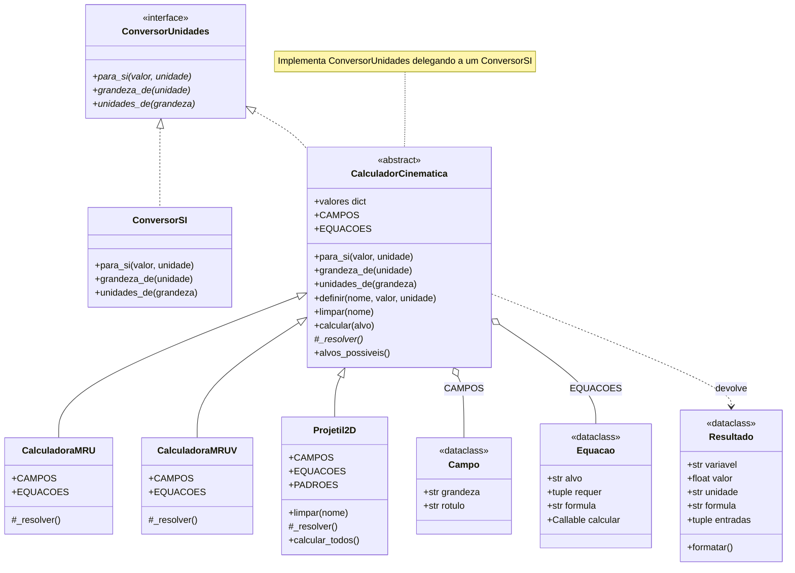
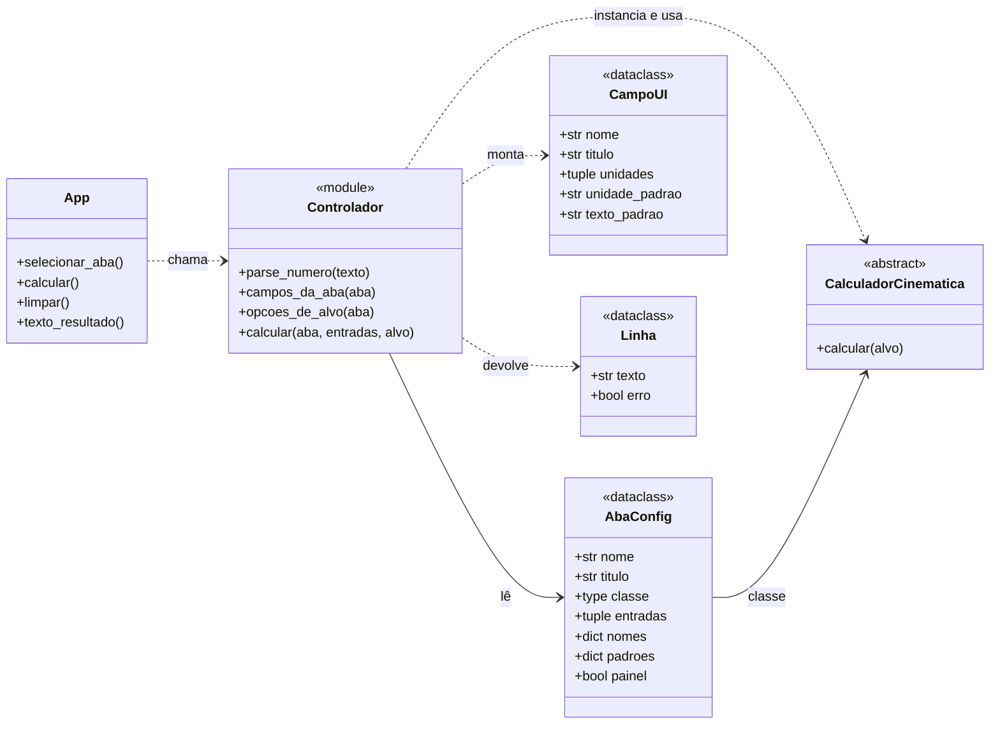
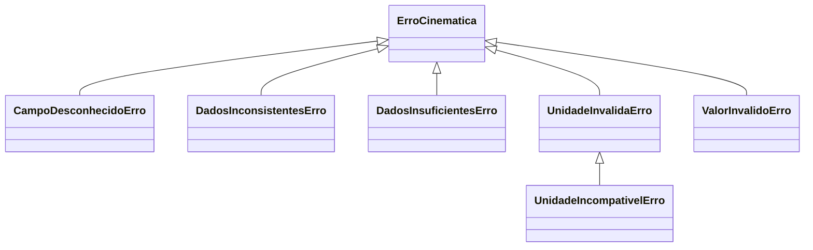

# Diagramas UML

Gerado por `python gerar_uml.py` a partir das classes reais.

## Núcleo (regras e modelos)

```mermaid
classDiagram
    direction TB
    class ConversorUnidades {
        <<interface>>
        +para_si(valor, unidade)*
        +grandeza_de(unidade)*
        +unidades_de(grandeza)*
    }
    class ConversorSI {
        +para_si(valor, unidade)
        +grandeza_de(unidade)
        +unidades_de(grandeza)
    }
    class CalculadorCinematica {
        <<abstract>>
        +valores dict
        +CAMPOS
        +EQUACOES
        +para_si(valor, unidade)
        +grandeza_de(unidade)
        +unidades_de(grandeza)
        +definir(nome, valor, unidade)
        +limpar(nome)
        +calcular(alvo)
        #_resolver()*
        +alvos_possiveis()
    }
    class CalculadoraMRU {
        +CAMPOS
        +EQUACOES
        #_resolver()
    }
    class CalculadoraMRUV {
        +CAMPOS
        +EQUACOES
        #_resolver()
    }
    class Projetil2D {
        +CAMPOS
        +EQUACOES
        +PADROES
        +limpar(nome)
        #_resolver()
        +calcular_todos()
    }
    class Campo {
        <<dataclass>>
        +str grandeza
        +str rotulo
    }
    class Equacao {
        <<dataclass>>
        +str alvo
        +tuple requer
        +str formula
        +Callable calcular
    }
    class Resultado {
        <<dataclass>>
        +str variavel
        +float valor
        +str unidade
        +str formula
        +tuple entradas
        +formatar()
    }
    ConversorUnidades <|.. ConversorSI
    ConversorUnidades <|.. CalculadorCinematica
    CalculadorCinematica <|-- CalculadoraMRU
    CalculadorCinematica <|-- CalculadoraMRUV
    CalculadorCinematica <|-- Projetil2D
    CalculadorCinematica o-- Campo : CAMPOS
    CalculadorCinematica o-- Equacao : EQUACOES
    CalculadorCinematica ..> Resultado : devolve
    note for CalculadorCinematica "Implementa ConversorUnidades delegando a um ConversorSI"
```

## Apresentação (GUI e controlador)

```mermaid
classDiagram
    direction LR
    class App {
        +selecionar_aba()
        +calcular()
        +limpar()
        +texto_resultado()
    }
    class Controlador {
        <<module>>
        +parse_numero(texto)
        +campos_da_aba(aba)
        +opcoes_de_alvo(aba)
        +calcular(aba, entradas, alvo)
    }
    class AbaConfig {
        <<dataclass>>
        +str nome
        +str titulo
        +type classe
        +tuple entradas
        +dict nomes
        +dict padroes
        +bool painel
    }
    class CampoUI {
        <<dataclass>>
        +str nome
        +str titulo
        +tuple unidades
        +str unidade_padrao
        +str texto_padrao
    }
    class Linha {
        <<dataclass>>
        +str texto
        +bool erro
    }
    class CalculadorCinematica {
        <<abstract>>
        +calcular(alvo)
    }
    App ..> Controlador : chama
    Controlador ..> CalculadorCinematica : instancia e usa
    Controlador --> AbaConfig : lê
    Controlador ..> CampoUI : monta
    Controlador ..> Linha : devolve
    AbaConfig --> CalculadorCinematica : classe
```

## Erros

```mermaid
classDiagram
    direction TB
    class CampoDesconhecidoErro {
    }
    class DadosInconsistentesErro {
    }
    class DadosInsuficientesErro {
    }
    class ErroCinematica {
    }
    class UnidadeIncompativelErro {
    }
    class UnidadeInvalidaErro {
    }
    class ValorInvalidoErro {
    }
    ErroCinematica <|-- CampoDesconhecidoErro
    ErroCinematica <|-- DadosInconsistentesErro
    ErroCinematica <|-- DadosInsuficientesErro
    UnidadeInvalidaErro <|-- UnidadeIncompativelErro
    ErroCinematica <|-- UnidadeInvalidaErro
    ErroCinematica <|-- ValorInvalidoErro
```
